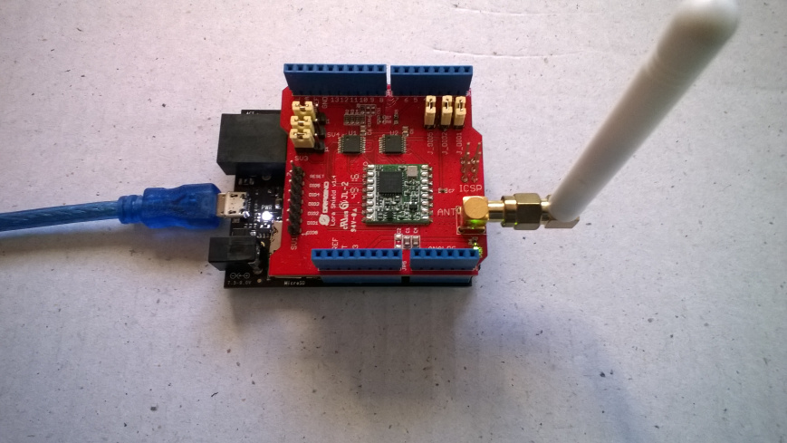
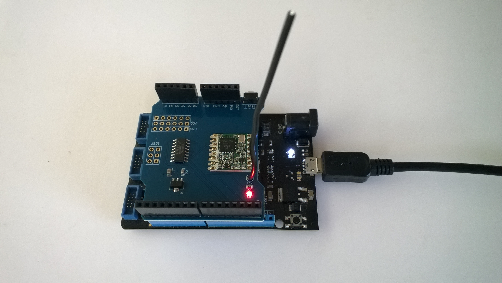

# RFM9XLoRa-NetMF
A C# library for LoRa[@LoRaAlliance](https://lora-alliance.org/) connectivity for Semtech [@SX127X](https://www.semtech.com/products/wireless-rf/lora-transceivers/SX1276)/HopeRF [@RFM9X](http://www.hoperf.com/rf_transceiver/lora/RFM95W.html) equipped shields on .NetMF device.

The repo has the source code for the series of blog posts written as I built this library

01. ShieldSPI (https://blog.devmobile.co.nz/2018/08/16/net-microframework-lora-library-part1/)
02. RegisterRead(https://blog.devmobile.co.nz/2018/08/17/net-microframework-lora-library-part2/)
03. RegisterScan(https://blog.devmobile.co.nz/2018/08/18/net-microframework-lora-library-part3/)
04. RegisterReadAndWrite(https://blog.devmobile.co.nz/2018/08/18/net-microframework-lora-library-part4/)
05. TransmitBasic(https://blog.devmobile.co.nz/2018/08/19/net-microframework-lora-library-part5/)
06. ReceiveBasic(https://blog.devmobile.co.nz/2018/08/19/net-microframework-lora-library-part6/)
07. ReceiveInterrupt(https://blog.devmobile.co.nz/2018/08/20/net-microframework-lora-library-part7/)
08. TransmitInterrupt(https://blog.devmobile.co.nz/2018/08/21/net-microframework-lora-library-part8/)
09. ReceiveTransmitInterrupt(https://blog.devmobile.co.nz/2018/08/22/net-microframework-lora-library-part9/)
10. RefactorRegisterManager
11. EnumAndMasks
12. ReceiveTransmitEvents

Fully featured driver and sample application
Rfm9xLoRaDeviceClient 
Rfm9XLoRaDevice

Signal To Noise(SNR) and Receive Signal Strength Indication(RSSI) (https://blog.devmobile.co.nz/2018/09/01/rfm9xloradevice-snr-and-rssi-2/)

Low Noise Amplifier(LNA) (https://blog.devmobile.co.nz/2018/09/01/rfm9xloradevice-netmf-lna/)

There is also a parallel development project for .Net which is documented here (https://github.com/KiwiBryn/RFM9XLoRa-Net)

Shield from [@Dragino](http://www.dragino.com/products/lora/item/102-lora-shield.html)

Shield from [@Elecrow ](https://www.elecrow.com/lora-rfm95-shield-915mhz.html)

